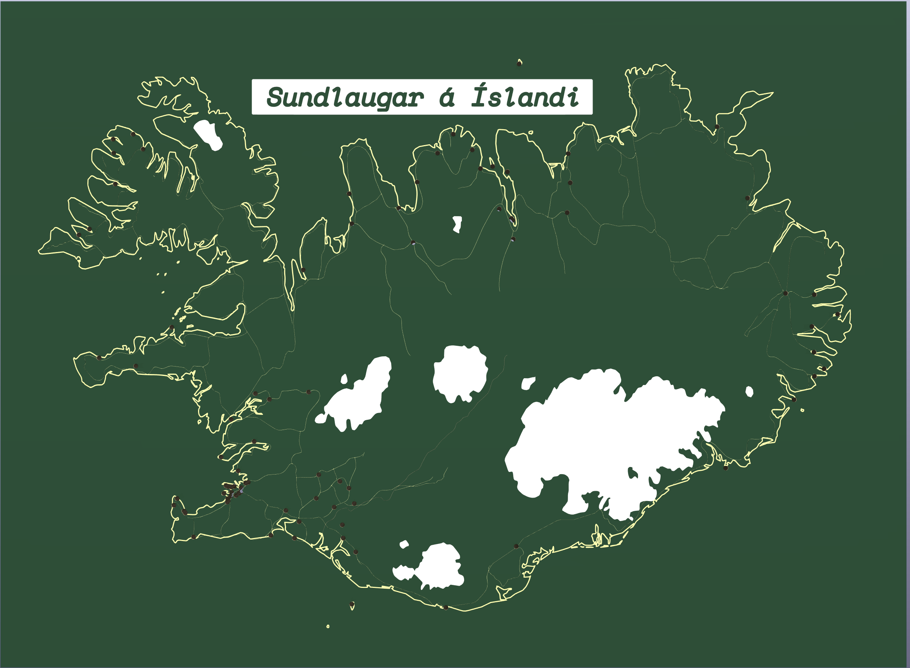
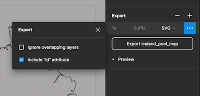

# Stylized PCBs in KiCad using Figma
*Using Thea Flowers' wonderful Gingerbread utilities with Figma generated SVGs*

**TL;DR**
---
1. Create design
2. Single outer group
3. Groups/layers with correct names inside and no white layers
4. Flatten everything to paths, drills need to be circles
5. 100 points/mm
6. Select outer group, export as svg with 'Include "id" attribute' checked
7. Remove outermost layer from svg
8. python3 -m gingerbread.convert filename.svg -> kicad_pcb
---

As soon as I saw Thea had released her utilities for generating KiCad PCBs from Affinity Designer I knew I had to test it out with Figma (since I don't have Affinity but occasionally use Figma). Here are the steps I took to get the above result:

Gingerbread.convert searches for each layer by their ID. If you check *'Include "id" attribute'* in the export options each layer's name is set as its id in the svg.

Each layer can be a group so as long as the name matches you can use it to organize your design. Drills have to be circles (ellipses with width == height are exported as circle), text should be flattened to paths etc but otherwise you are pretty free to design however.

**One hurdle I hit is that if you have a white layer, the rasterization step in gingerbread.convert won't see anything since it uses a threshold to find the shape. It can be whatever color since it doesn't affect the outcome so just make sure it's dark enough to register.**

The last bit of trouble was that if you select a group and export it you can't skip the outermost <g></g> layer. I just wrote a little script *'remove_outermost_tag.py'* to check if any layer had the same name as the filename (since Figma by default names the file after the layer you have seleted) and if so delete that beginning and end <g></g> tag.

Figma doesn't really allow you to set the dpi clearly but if you set sizes in points in the document and don't choose a dpi in gingerbread.convert it automatically uses 100 points to a mm. So my document was 6000 points across and 60.0mm in KiCad.
