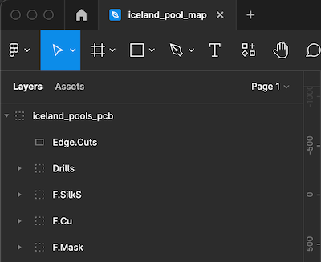

# Stylized PCBs in KiCad using Figma
*Using Thea Flowers' wonderful Gingerbread utilities with Figma generated SVGs*

As soon as I saw Thea had released her utilities for generating KiCad PCBs from Affinity Designer I knew I had to test it out with Figma (since I don't have Affinity but occasionally use Figma). Here are the steps I took to get this result:

Gingerbread.convert searches for each layer by their ID. If you check *'Include "id" attribute'* in the export options each layer's name is set as its id in the svg.

The layers in my file:

